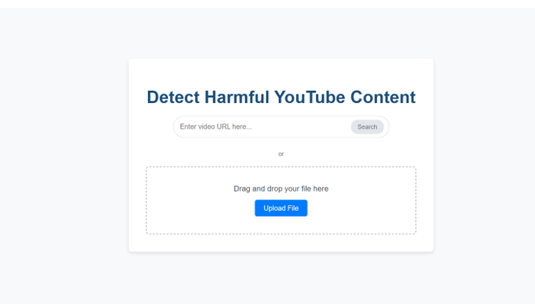
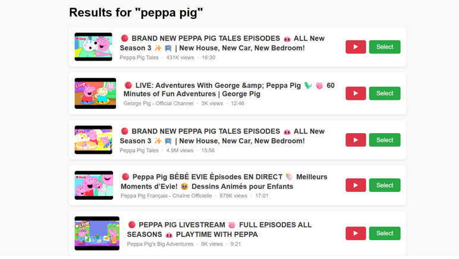
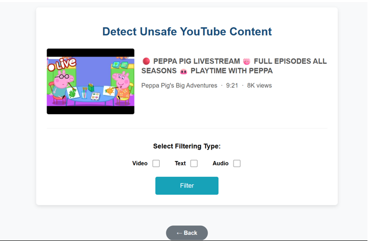
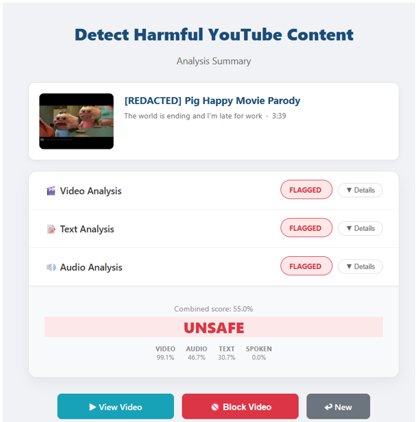
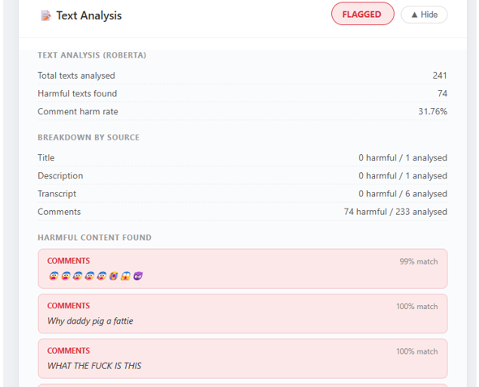
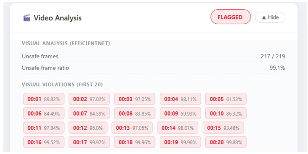
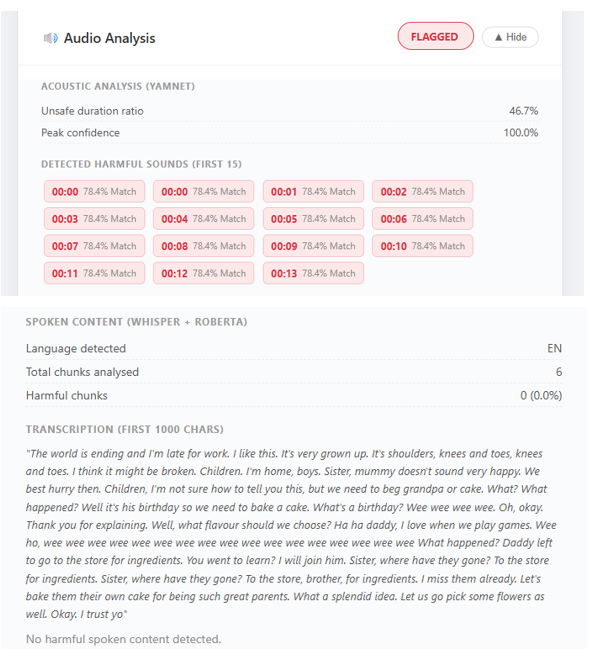

# Detecting Unsafe Content in YouTube Videos Aimed at Children Using Multimodal Analysis

A multimodal deep learning system that analyzes the **text, visuals, and audio** of YouTube videos to flag content that is unsafe for children, combining the outputs through a weighted fusion layer and surfacing the result in a web interface.

## Overview

A child can open YouTube, click on what looks like a cartoon, and within seconds be exposed to content no parent would approve of — and current safety tools still miss a lot of it. This project builds a system that inspects a video across three modalities instead of relying on a single signal:

- **Text** — video titles, descriptions, comments, and transcripts (with automatic language detection and translation) classified with a fine-tuned **RoBERTa** model.
- **Visuals** — sampled video frames classified with **EfficientNet-B2**.
- **Audio** — non-verbal sounds classified with **YAMNet**, while spoken audio is transcribed (Whisper) and routed through the same RoBERTa text model so harmful speech isn't missed.

The three modality scores are combined in a **weighted fusion layer** to produce a final Safe/Unsafe verdict, accessible through a Flask web app that accepts both YouTube URLs and local video uploads.

## Features

- 🔍 Search or paste a YouTube URL, or upload a local video/subtitle file
- 🧩 Select which modalities (text, video, audio) to run per analysis
- 🧠 Independent per-modality classification plus a combined weighted-fusion verdict
- 🌐 Automatic language detection and translation for non-English text/speech
- 📊 Analysis report page with per-modality breakdown and manual block option
- 💾 Persistent storage of videos, analyses, and per-modality scores in a database

## System Architecture

```
User Input (YouTube URL / Search / Local Upload)
        │
        ▼
 ┌─────────────┬──────────────┬──────────────┐
 │   Text      │    Visual    │    Audio     │
 │ (RoBERTa)   │(EfficientNet │  (YAMNet +   │
 │             │    -B2)      │  Whisper)    │
 └─────────────┴──────────────┴──────────────┘
        │              │              │
        └──────────────┴──────────────┘
                     ▼
            Weighted Fusion Layer
                     ▼
           Safe / Unsafe Verdict
                     ▼
              Web Report Page
```

## Models & Performance

| Modality | Model | Precision | Recall | F1-Score |
|---|---|---|---|---|
| Text | RoBERTa (fine-tuned) | 0.945 | 0.948 | 0.945 |
| Video | EfficientNet-B2 | 0.950 | 0.950 | 0.950 |
| Audio | YAMNet | 0.808 | 0.804 | 0.802 |

Text and video modalities were the strongest and most consistent signals; non-verbal audio was more variable due to the complexity of environmental sounds, but still added value to the combined system.

**Fusion weights:** Video 40% · Text 35% · Spoken Audio 15% · Non-Spoken Audio 10% (redistributed proportionally if a modality is unavailable). The fused score is flagged **unsafe** at a threshold of 0.30.

## Datasets

- **Text:** Datasets sourced from Kaggle and Hugging Face, merged and de-duplicated into a combined dataset of 339,763 labelled samples (175,148 safe / 164,585 unsafe).
- **Visual:** Frames extracted at 1 FPS from collected child-oriented videos, resized to 260×260 — 8,625 safe / 9,847 unsafe frames.
- **Audio:** 2,075 manually collected clips (128 kbps MP3, 2–30s) — 1,064 safe / 1,011 unsafe.

## Tech Stack

| Component | Choice |
|---|---|
| Language | Python |
| Web framework | Flask |
| Database | SQLite |
| IDE / Training | PyCharm, Google Colab |
| Text model | RoBERTa (Transformers) |
| Visual model | EfficientNet-B2 (timm) |
| Audio model | YAMNet |
| Speech-to-text | OpenAI Whisper |
| Data sources | YouTube Data API v3, YouTube Transcript API, yt-dlp |
| Other libraries | scikit-learn, pandas, NumPy, Matplotlib, Pillow, OpenCV, langdetect, deep_translator |

## Database Schema

| Table | Purpose |
|---|---|
| `videos` | Metadata for every unique video submitted for analysis |
| `analyses` | One row per analysis run (a video can be re-analyzed with different modality combinations) |
| `modality_scores` | One row per modality per analysis run (e.g. Video + Text + Audio → 3 rows) |

## Getting Started

> ⚠️ Adjust file/folder names below to match this repository's actual layout.

### Prerequisites
- Python 3.9+
- pip
- A YouTube Data API v3 key

### Installation

```bash
git clone <this-repo-url>
cd <repo-folder>
python -m venv venv
source venv/bin/activate      # Windows: venv\Scripts\activate
pip install -r requirements.txt
```

### Configuration

Create a `.env` file (or export environment variables) with your API credentials:

```
YOUTUBE_API_KEY=your_youtube_api_key
```

### Run the app

```bash
flask run
```

Then open `http://localhost:5000` in your browser, search for a video (or paste a URL / upload a file), choose which modalities to run, and view the generated analysis report.

## Web Interface

- **Home Page** — search by video name/URL or upload a local file
- **Search Result Page** — browse the top 10 matching YouTube results
- **Select Filter Page** — choose which modality(ies) to analyze
- **Analysis Report Page** — view the safe/unsafe verdict, per-modality breakdown, and optionally block the video

## Screenshots

### Home Page



### YouTube Search



### Modality Selection



### Analysis



### Text Analysis



### Visual Analysis



### Audio Analysis



## Limitations & Future Work

- Extend to **live stream** monitoring in real time
- **Playlist-level** batch analysis with an aggregate safety profile
- Move from binary Safe/Unsafe to **multilevel classification**
- Improve **multilingual** detection with more advanced or directly multilingual-trained models
- Broaden the visual/audio datasets beyond cartoons and expand environmental sound diversity